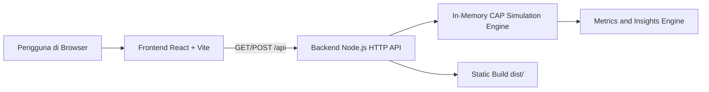

# TUGAS 4 - CAP Theorem Simulation App

## Identitas Mahasiswa

Nama: RIFKI NUR FAHREZI AHMAD  
NIM: 105841104723

## Dokumentasi Tampilan Aplikasi

Bagian ini disusun berdasarkan screenshot hasil implementasi aplikasi yang dilampirkan. Tujuannya adalah agar pembaca dapat langsung memahami tampilan utama aplikasi serta hubungan antara teori CAP Theorem dan simulasi yang dibangun.

Secara umum, maksud dari dokumentasi tampilan ini adalah menunjukkan bahwa aplikasi tidak hanya berisi teori CAP Theorem, tetapi juga mampu memperlihatkan bagaimana konsep tersebut bekerja dalam bentuk simulasi, studi kasus, dan analisis sistem nyata.

### 1. Dashboard Simulasi Interaktif

    

Screenshot dashboard simulasi memperlihatkan bahwa aplikasi ini bukan hanya animasi visual, tetapi simulator interaktif yang benar-benar menunjukkan perilaku sistem terdistribusi.

Pada halaman ini terlihat beberapa komponen penting sekaligus:

- mode aktif `CP` atau `AP`
- status jaringan `NORMAL` atau `PARTISI`
- visualisasi topologi 3 node
- panel `cluster health`
- skor `consistency` dan `availability`
- tombol aksi `write`, `trigger partition`, `heal`, `reset`, dan `auto demo`
- hasil `read` terakhir dari node tertentu
- event log sebagai jejak perilaku sistem

Dari screenshot simulasi, dapat dilihat bahwa aplikasi mampu menunjukkan perubahan keadaan sistem secara langsung. Saat mode `AP` aktif, write tetap diterima walaupun partisi terjadi. Hal ini dapat dibuktikan kembali melalui hasil read dan event log, sehingga konsep stale read tidak hanya dijelaskan, tetapi benar-benar disimulasikan.

**Maksud dari tampilan ini** adalah menunjukkan bahwa CAP Theorem dapat diamati secara langsung melalui perilaku node, perubahan status jaringan, hasil pembacaan data, serta log aktivitas sistem. Halaman ini menjadi bukti bahwa aplikasi bekerja sebagai simulator, bukan hanya sebagai media presentasi teori.

### 2. Halaman Studi Kasus Sistem Perbankan

    

Screenshot studi kasus sistem perbankan menunjukkan penerapan CAP pada domain yang menuntut konsistensi tinggi.

Pada halaman ini ditampilkan:

- analogi sistem perbankan
- skenario nyata transaksi ATM atau transfer
- poin kunci mengapa perbankan lebih dekat ke `CP`
- contoh database yang umum dikaitkan dengan kebutuhan konsistensi
- ringkasan perbandingan `CP` dan `AP`

Makna utama dari tampilan ini adalah bahwa pada sistem perbankan, data harus benar di semua node. Karena itu, ketika partisi jaringan terjadi, sistem lebih baik menolak request sementara daripada mengembalikan hasil yang salah.

**Maksud dari tampilan ini** adalah menjelaskan bahwa pada domain perbankan, konsistensi adalah prioritas utama. Dengan demikian, contoh ini memperlihatkan alasan mengapa sistem perbankan lebih dekat ke pendekatan `CP`.

### 3. Halaman Studi Kasus Media Sosial

    

Screenshot studi kasus media sosial memperlihatkan contoh sistem yang lebih dekat ke `AP`.

Halaman ini menjelaskan bahwa:

- layanan media sosial harus selalu responsif
- keterlambatan kecil pada feed masih dapat diterima
- availability lebih diprioritaskan daripada konsistensi langsung
- eventual consistency menjadi pendekatan yang realistis

Tampilan ini penting karena menunjukkan bahwa tidak semua sistem harus memilih konsistensi sebagai prioritas utama. Untuk domain seperti media sosial, aplikasi yang tetap aktif dan cepat sering kali lebih penting daripada data yang seragam pada detik yang sama.

**Maksud dari tampilan ini** adalah menunjukkan bahwa pada media sosial, availability lebih penting dibanding konsistensi langsung. Oleh karena itu, contoh ini membantu menjelaskan alasan mengapa media sosial lebih dekat ke pendekatan `AP`.

### 4. Halaman Studi Kasus E-Commerce

    

Screenshot studi kasus e-commerce menunjukkan bahwa satu sistem dapat menggabungkan pendekatan `CP` dan `AP` sekaligus, tergantung fitur yang sedang dibahas.

Isi halaman menegaskan bahwa:

- katalog produk dapat lebih toleran terhadap keterlambatan update
- keranjang belanja masih dapat menerima sedikit delay
- checkout, stok, dan pembayaran harus akurat
- keputusan arsitektur harus mengikuti kebutuhan bisnis tiap proses

Nilai akademik dari halaman ini adalah penjelasan bahwa CAP tidak selalu diterapkan secara kaku pada seluruh sistem. Dalam praktik nyata, satu aplikasi besar dapat memakai pendekatan berbeda pada komponen yang berbeda.

**Maksud dari tampilan ini** adalah menjelaskan bahwa e-commerce merupakan contoh sistem campuran. Beberapa fitur membutuhkan konsistensi tinggi, sedangkan fitur lain dapat menerima keterlambatan sinkronisasi. Ini menunjukkan bahwa keputusan arsitektur harus mengikuti kebutuhan bisnis.

## Deskripsi Singkat

Tugas 4 ini adalah aplikasi simulasi CAP Theorem yang dibuat untuk membantu memahami trade-off antara Consistency, Availability, dan Partition Tolerance pada sistem terdistribusi. Pengguna dapat memilih mode `CP` atau `AP`, memicu network partition, melakukan write dan read ke node tertentu, memulihkan jaringan, menjalankan auto demo, dan melihat perubahan status cluster serta event log secara langsung.

Frontend yang sudah ada dikembangkan dengan backend Node.js agar logika simulasi tidak hanya berjalan di browser. Dengan pendekatan ini, state simulator, logika cluster, hasil read, indikator stale data, dan metrik observabilitas diproses secara konsisten oleh backend.

**Maksud utama aplikasi ini** adalah membantu mahasiswa atau pembaca memahami bahwa CAP Theorem bukan hanya teori tentang memilih `Consistency`, `Availability`, dan `Partition Tolerance`, tetapi juga tentang memahami dampak pilihan tersebut terhadap perilaku sistem ketika gangguan jaringan benar-benar terjadi.

## Fitur Utama

- Simulasi mode `CP` dan `AP`.
- Visualisasi 3 node dan konektivitas jaringan.
- Aksi write ke Node A dan Node B.
- Aksi read ke Node A, Node B, dan Node C.
- Deteksi stale read saat partisi pada mode `AP`.
- Trigger network partition dan pemulihan jaringan.
- Event log yang mengikuti hasil keputusan backend.
- Metrik cluster: accepted write, rejected write, total read, stale read, network event, consistency score, dan availability score.
- Auto demo skenario `CP` dan `AP` untuk presentasi.
- Tab teori CAP dan studi kasus nyata.
- Siap dijalankan secara lokal maupun melalui Docker.

## Arsitektur Sistem

### Penjelasan Arsitektur

1. Frontend menggunakan React dan Vite untuk menampilkan simulator, teori, dan studi kasus.
2. Backend menggunakan Node.js native HTTP server untuk menyediakan API simulasi.
3. Simulation engine di backend menyimpan state node, koneksi, mode CAP, status busy, hasil read, dan event log di memory.
4. Metrics and insights engine menghitung stale read, availability score, consistency score, divergence node, dan rekomendasi kondisi cluster.
5. Untuk development, backend menjalankan Vite dalam middleware mode sehingga frontend dan backend berjalan pada satu port yang sama.
6. Untuk production dan Docker, frontend dibuild ke folder `dist` lalu disajikan langsung oleh backend yang sama.

### Komponen Utama

- `src/app/App.tsx` berisi UI utama, dashboard simulasi, studi kasus, dan integrasi request ke backend.
- `server/index.mjs` berisi API, logika simulasi, perhitungan metrics, dan static file server.
- `Dockerfile` membangun frontend lalu menjalankan backend production.
- `docker-compose.yml` memudahkan deployment satu container.

## Alur Backend

Backend memodelkan perilaku yang sama seperti simulator pada frontend:

1. Mode `CP` akan menolak write saat partisi jika node tidak dapat mengonfirmasi ke node lain.
2. Mode `AP` akan tetap menerima write saat partisi walaupun sebagian node menjadi stale.
3. Read ke tiap node dievaluasi terhadap versi data terbaru sehingga sistem bisa mendeteksi stale read.
4. Saat jaringan dipulihkan, backend memicu sinkronisasi dan frontend mengambil snapshot state terbaru dari API.
5. Metrics dan insight cluster dihitung dari hasil write, read, partition, heal, dan sinkronisasi.
6. Event log dikirim dari backend agar hasil simulasi tetap konsisten dengan state aktual sistem.

## Endpoint API

- `GET /api/health` untuk health check service.
- `GET /api/info` untuk informasi aplikasi, identitas, dan arsitektur.
- `GET /api/simulation` untuk mengambil snapshot state simulator beserta metrics dan insight cluster.
- `POST /api/simulation/mode` untuk mengganti mode `CP` atau `AP`.
- `POST /api/simulation/actions/partition` untuk memicu network partition.
- `POST /api/simulation/actions/heal` untuk memulihkan jaringan.
- `POST /api/simulation/actions/write` untuk write ke node tertentu.
- `POST /api/simulation/actions/read` untuk read dari node tertentu.
- `POST /api/simulation/actions/reset` untuk reset simulasi ke kondisi awal.

## Alur Presentasi Singkat

Urutan presentasi yang disarankan:

1. Tunjukkan dashboard simulasi sebagai bukti bahwa aplikasi memiliki backend, metrik, dan event log.
2. Jalankan mode `CP` lalu tunjukkan bahwa write bisa ditolak saat partisi demi menjaga konsistensi.
3. Jalankan mode `AP` lalu lakukan read pada node berbeda untuk menunjukkan stale read.
4. Tunjukkan halaman studi kasus perbankan, media sosial, dan e-commerce untuk menghubungkan teori dengan praktik.

## Menjalankan Secara Lokal

### Mode Development

1. Buka terminal pada folder `TUGAS 4`.
2. Jalankan `npm install`.
3. Jalankan `npm run dev`.
4. Buka `http://localhost:3000`.

Mode ini menjalankan backend dan frontend dalam satu server development.

### Mode Production Lokal

1. Jalankan `npm run build`.
2. Jalankan `npm run start`.
3. Buka `http://localhost:3000`.

## Menjalankan Dengan Docker

1. Buka terminal pada folder `TUGAS 4`.
2. Jalankan `docker compose up --build -d`.
3. Buka `http://localhost:3000`.
4. Untuk menghentikan container, jalankan `docker compose down`.

## Validasi yang Sudah Dilakukan

- Dependency proyek berhasil di-install dengan `npm install`.
- Build frontend berhasil dengan `npm run build`.
- Runtime production berhasil diuji melalui endpoint aplikasi dan API.
- Docker berhasil dibangun dan dijalankan.
- Skenario `AP` berhasil diuji hingga menghasilkan stale read pada node yang tertinggal.

## Kesimpulan

Tugas 4 ini tidak hanya memiliki frontend interaktif, tetapi juga backend yang menangani logika simulasi CAP Theorem secara terpusat, metrik cluster, insight kondisi sistem, dan studi kasus kontekstual. Struktur ini membuat aplikasi lebih rapi, lebih kuat secara akademik, lebih mudah dipresentasikan, dan siap dijalankan baik di lokal maupun melalui Docker.
